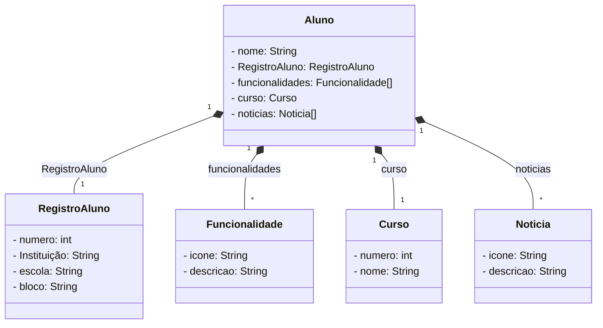

# Projeto DIO: Publicando Sua API REST na Nuvem Usando Spring Boot 3, Java 17 e Railway - (Status do Projeto: Incompleto).

**Temática: Aluno e Curso. (Adaptando o projeto).**

# Diagrama De Classe do Projeto:

**Java RestFul Api.**

``